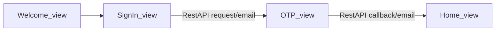
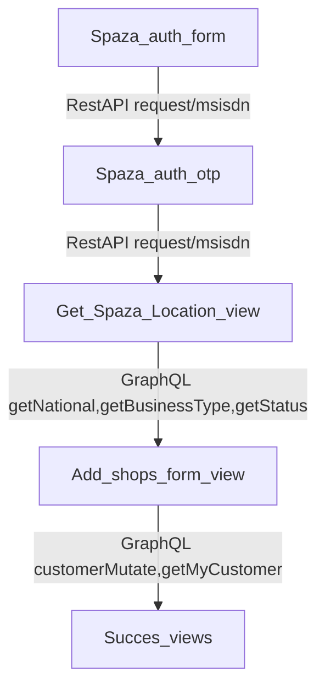

# thanx_web
Vue JS website 

## Sign in flow

```mermaid
graph LR;
    Welcome_view-->SignIn_view;
    SignIn_view--RestAPI request/email-->OTP_view;
    OTP_view--RestAPI callback/email-->Home_view;
```

## Register customer flow 

```mermaid
graph TD;
    Spaza_auth_form--RestAPI request/msisdn-->Spaza_auth_otp;
   Spaza_auth_otp--RestAPI request/msisdn-->Get_Spaza_Location_view;
   Get_Spaza_Location_view--GraphQL getNational,getBusinessType,getStatus-->Add_shops_form_view;
   Add_shops_form_view--GraphQL customerMutate,getMyCustomer-->Succes_views
```